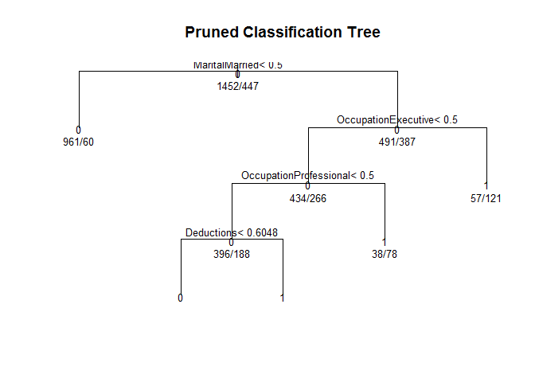

HW3-Audit-Classification
================
Liping Li (<lil112@pitt.edu>)
2017.02.14

Preparation
===========

### Load function script

``` r
source("hw3-functions.R")
```

    ## [1] "Dependency packages: ROCR, e1071, rpart, class, ada, data.table, randomForest"

``` r
# need to write the full path if it is't under working directiory.

# Modified the shared script  (http://www.yurulin.com/class/spring2017_datamining/src/hw3-sample.html)

# Major changes are 
# 1. Add prepare.data module
# 2. Add perfMeasures function to return a list of performance measures
# 3. Add matMeasures function to return cutoff specified measures
# 4. Add parameters(nn for knn neighbor numbers, gamma &cost for svm, cp for tree)
```

### Load relevant R packages

``` r
# install.packages("ROCR","e1071","rpart","class","randomForest","ada","knitr","data.table","plyr")
library(ROCR) # performance measures and plot
```

    ## Loading required package: gplots

    ## 
    ## Attaching package: 'gplots'

    ## The following object is masked from 'package:stats':
    ## 
    ##     lowess

``` r
library(e1071) # svm naiveBayes
library(rpart) # decision tree
library(class) # knn
library(ada) # adaBoost
library(plyr) # coding data
library(data.table) # data manipulation
suppressMessages(library(randomForest))# bagging variation
library(knitr) # nice table
```

### Load data

``` r
dataset=load.data("http://www.yurulin.com/class/spring2017_datamining/data/audit.csv")
```

    ## [1] "load data, remove ID, missing values and RISK_Adjustment"

### Prepare data

``` r
dataset1=prepare.data(dataset, dummies=T, maskDummies=F,scale=T, y=10)
```

    ##   Age Employment Education   Marital Occupation   Income Gender Deductions
    ## 1  38    Private   College Unmarried    Service  81838.0 Female          0
    ## 2  35    Private Associate    Absent  Transport  72099.0   Male          0
    ## 3  32    Private    HSgrad  Divorced   Clerical 154676.7   Male          0
    ##   Hours TARGET_Adjusted
    ## 1    72               0
    ## 2    30               0
    ## 3    40               0
    ## encode  5 categories into dummies... 
    ## standardize  4  numeric variables 0-1... 
    ## rename response as y, combine response, categorical variables and numeric 
    ##       variables 
    ##  
    ##   y EmploymentConsultant EmploymentPrivate EmploymentPSFederal
    ## 1 0                    0                 1                   0
    ## 2 0                    0                 1                   0
    ## 3 0                    0                 1                   0
    ##   EmploymentPSLocal EmploymentPSState EmploymentSelfEmp
    ## 1                 0                 0                 0
    ## 2                 0                 0                 0
    ## 3                 0                 0                 0
    ##   EmploymentUnemployed EmploymentVolunteer EducationBachelor
    ## 1                    0                   0                 0
    ## 2                    0                   0                 0
    ## 3                    0                   0                 0
    ##   EducationCollege EducationDoctorate EducationHSgrad EducationMaster
    ## 1                1                  0               0               0
    ## 2                0                  0               0               0
    ## 3                0                  0               1               0
    ##   EducationPreschool EducationProfessional EducationVocational
    ## 1                  0                     0                   0
    ## 2                  0                     0                   0
    ## 3                  0                     0                   0
    ##   EducationYr10 EducationYr11 EducationYr12 EducationYr1t4 EducationYr5t6
    ## 1             0             0             0              0              0
    ## 2             0             0             0              0              0
    ## 3             0             0             0              0              0
    ##   EducationYr7t8 EducationYr9 MaritalDivorced MaritalMarried
    ## 1              0            0               0              0
    ## 2              0            0               0              0
    ## 3              0            0               1              0
    ##   MaritalMarried.spouse.absent MaritalUnmarried MaritalWidowed
    ## 1                            0                1              0
    ## 2                            0                0              0
    ## 3                            0                0              0
    ##   OccupationClerical OccupationExecutive OccupationFarming OccupationHome
    ## 1                  0                   0                 0              0
    ## 2                  0                   0                 0              0
    ## 3                  1                   0                 0              0
    ##   OccupationMachinist OccupationMilitary OccupationProfessional
    ## 1                   0                  0                      0
    ## 2                   0                  0                      0
    ## 3                   0                  0                      0
    ##   OccupationProtective OccupationRepair OccupationSales OccupationService
    ## 1                    0                0               0                 1
    ## 2                    0                0               0                 0
    ## 3                    0                0               0                 0
    ##   OccupationSupport OccupationTransport GenderMale       Age    Income
    ## 1                 0                   0          0 0.3181818 0.1689968
    ## 2                 0                   1          1 0.2727273 0.1487347
    ## 3                 0                   0          1 0.2272727 0.3205390
    ##   Deductions     Hours
    ## 1          0 0.7244898
    ## 2          0 0.2959184
    ## 3          0 0.3979592

``` r
# Since we need to split data, to avoid incompatible categories levels, I make them dummies first.
# Some methods cannot deal with complicated variable names, so I write maskDummies part in case.
# knn and svm will be impacted by variables value range
# y represent response variable position
```

``` r
dataset2=prepare.data(dataset, dummies=T, maskDummies=F,scale=F, y=10)
```

    ##   Age Employment Education   Marital Occupation   Income Gender Deductions
    ## 1  38    Private   College Unmarried    Service  81838.0 Female          0
    ## 2  35    Private Associate    Absent  Transport  72099.0   Male          0
    ## 3  32    Private    HSgrad  Divorced   Clerical 154676.7   Male          0
    ##   Hours TARGET_Adjusted
    ## 1    72               0
    ## 2    30               0
    ## 3    40               0
    ## encode  5 categories into dummies... 
    ## rename response as y, combine response, categorical variables and numeric 
    ##       variables 
    ##  
    ##   y EmploymentConsultant EmploymentPrivate EmploymentPSFederal
    ## 1 0                    0                 1                   0
    ## 2 0                    0                 1                   0
    ## 3 0                    0                 1                   0
    ##   EmploymentPSLocal EmploymentPSState EmploymentSelfEmp
    ## 1                 0                 0                 0
    ## 2                 0                 0                 0
    ## 3                 0                 0                 0
    ##   EmploymentUnemployed EmploymentVolunteer EducationBachelor
    ## 1                    0                   0                 0
    ## 2                    0                   0                 0
    ## 3                    0                   0                 0
    ##   EducationCollege EducationDoctorate EducationHSgrad EducationMaster
    ## 1                1                  0               0               0
    ## 2                0                  0               0               0
    ## 3                0                  0               1               0
    ##   EducationPreschool EducationProfessional EducationVocational
    ## 1                  0                     0                   0
    ## 2                  0                     0                   0
    ## 3                  0                     0                   0
    ##   EducationYr10 EducationYr11 EducationYr12 EducationYr1t4 EducationYr5t6
    ## 1             0             0             0              0              0
    ## 2             0             0             0              0              0
    ## 3             0             0             0              0              0
    ##   EducationYr7t8 EducationYr9 MaritalDivorced MaritalMarried
    ## 1              0            0               0              0
    ## 2              0            0               0              0
    ## 3              0            0               1              0
    ##   MaritalMarried.spouse.absent MaritalUnmarried MaritalWidowed
    ## 1                            0                1              0
    ## 2                            0                0              0
    ## 3                            0                0              0
    ##   OccupationClerical OccupationExecutive OccupationFarming OccupationHome
    ## 1                  0                   0                 0              0
    ## 2                  0                   0                 0              0
    ## 3                  1                   0                 0              0
    ##   OccupationMachinist OccupationMilitary OccupationProfessional
    ## 1                   0                  0                      0
    ## 2                   0                  0                      0
    ## 3                   0                  0                      0
    ##   OccupationProtective OccupationRepair OccupationSales OccupationService
    ## 1                    0                0               0                 1
    ## 2                    0                0               0                 0
    ## 3                    0                0               0                 0
    ##   OccupationSupport OccupationTransport GenderMale Age   Income Deductions
    ## 1                 0                   0          0  38  81838.0          0
    ## 2                 0                   1          1  35  72099.0          0
    ## 3                 0                   0          1  32 154676.7          0
    ##   Hours
    ## 1    72
    ## 2    30
    ## 3    40

``` r
# Since we need to split data, to avoid incompatible categories levels, I make them dummies first.
# Some methods cannot deal with complicated variable names, so I write maskDummies part in case.
# knn and svm will be impacted by variables value range
# y represent response variable position
```

1. All-variables Starter Models
===============================

### Logistic regression

Try logistic regression with numeric variable scaled and unscaled data.

``` r
set.seed(12312)
logistic1 = my.classifier(dataset=dataset1, cl.name = 'lr', do.cv = T)
```

    ## 10 -fold CV run 1 lr : #training: 1710 #testing  189 
    ## 10 -fold CV run 2 lr : #training: 1709 #testing  190 
    ## 10 -fold CV run 3 lr : #training: 1709 #testing  190 
    ## 10 -fold CV run 4 lr : #training: 1709 #testing  190 
    ## 10 -fold CV run 5 lr : #training: 1709 #testing  190 
    ## 10 -fold CV run 6 lr : #training: 1709 #testing  190 
    ## 10 -fold CV run 7 lr : #training: 1709 #testing  190 
    ## 10 -fold CV run 8 lr : #training: 1709 #testing  190 
    ## 10 -fold CV run 9 lr : #training: 1709 #testing  190 
    ## 10 -fold CV run 10 lr : #training: 1709 #testing  190 
    ## [1] "Confusion matrix calculated measures:"
    ## accuracy= 0.0785124 precision= 1 recall= 0.0785124 f-score= 0.1455939 
    ##  cutoff= 0.5 
    ## [1] "ROCR performance function calculated measures:"
    ## accuracy= 0.6349247 precision= 0.4771194 recall= 0.786043 f-score= 0.5096889 
    ## auc= 0.8744461

``` r
set.seed(12312)
logistic2 = my.classifier(dataset=dataset2, cl.name = 'lr', do.cv = T)
```

    ## 10 -fold CV run 1 lr : #training: 1710 #testing  189 
    ## 10 -fold CV run 2 lr : #training: 1709 #testing  190 
    ## 10 -fold CV run 3 lr : #training: 1709 #testing  190 
    ## 10 -fold CV run 4 lr : #training: 1709 #testing  190 
    ## 10 -fold CV run 5 lr : #training: 1709 #testing  190 
    ## 10 -fold CV run 6 lr : #training: 1709 #testing  190 
    ## 10 -fold CV run 7 lr : #training: 1709 #testing  190 
    ## 10 -fold CV run 8 lr : #training: 1709 #testing  190 
    ## 10 -fold CV run 9 lr : #training: 1709 #testing  190 
    ## 10 -fold CV run 10 lr : #training: 1709 #testing  190 
    ## [1] "Confusion matrix calculated measures:"
    ## accuracy= 0.07782369 precision= 1 recall= 0.07782369 f-score= 0.1444089 
    ##  cutoff= 0.5 
    ## [1] "ROCR performance function calculated measures:"
    ## accuracy= 0.6347147 precision= 0.4769642 recall= 0.7861557 f-score= 0.5096296 
    ## auc= 0.8744461

Results of two dataset are similar. I would use scaled data in the following anaylsis.

When the confusion matrix measures has higher precision, but a very low recall, suggesting **this cutoff is too strict** to label cases as positive(1 in this study). Since performance function give an average measures, it shows a higher recall and lower precision, demonstrating false positive rate is very low and false negative rate is very high at the cutoff level 0.5. Thus we will probably have a ROC curve that has a very big slope as the left side.

``` r
logisticROC = logistic1$ROC
plot(logisticROC)
```


### KNN

Since it's a big dataset, I start with nn=10.

``` r
set.seed(12312)
KNN10 = my.classifier(dataset=dataset1, cl.name = 'knn', nn=10, do.cv =T)
```

    ## 10 -fold CV run 1 knn : #training: 1710 #testing  189 
    ## 10 -fold CV run 2 knn : #training: 1709 #testing  190 
    ## 10 -fold CV run 3 knn : #training: 1709 #testing  190 
    ## 10 -fold CV run 4 knn : #training: 1709 #testing  190 
    ## 10 -fold CV run 5 knn : #training: 1709 #testing  190 
    ## 10 -fold CV run 6 knn : #training: 1709 #testing  190 
    ## 10 -fold CV run 7 knn : #training: 1709 #testing  190 
    ## 10 -fold CV run 8 knn : #training: 1709 #testing  190 
    ## 10 -fold CV run 9 knn : #training: 1709 #testing  190 
    ## 10 -fold CV run 10 knn : #training: 1709 #testing  190 
    ## [1] "Confusion matrix calculated measures:"
    ## accuracy= 0.05991736 precision= 1 recall= 0.05991736 f-score= 0.1130604 
    ##  cutoff= 0.5 
    ## [1] "ROCR performance function calculated measures:"
    ## accuracy= 0.7377957 precision= 0.5884248 recall= 0.5276328 f-score= 0.4597505 
    ## auc= 0.8467893

### Naive Bayes

``` r
set.seed(12312)
NB = my.classifier(dataset=dataset1, cl.name = 'nb', do.cv = T)
```

    ## 10 -fold CV run 1 nb : #training: 1710 #testing  189 
    ## 10 -fold CV run 2 nb : #training: 1709 #testing  190 
    ## 10 -fold CV run 3 nb : #training: 1709 #testing  190 
    ## 10 -fold CV run 4 nb : #training: 1709 #testing  190 
    ## 10 -fold CV run 5 nb : #training: 1709 #testing  190 
    ## 10 -fold CV run 6 nb : #training: 1709 #testing  190 
    ## 10 -fold CV run 7 nb : #training: 1709 #testing  190 
    ## 10 -fold CV run 8 nb : #training: 1709 #testing  190 
    ## 10 -fold CV run 9 nb : #training: 1709 #testing  190 
    ## 10 -fold CV run 10 nb : #training: 1709 #testing  190 
    ## [1] "Confusion matrix calculated measures:"
    ## accuracy= 0.7369146 precision= 1 recall= 0.7369146 f-score= 0.8485329 
    ##  cutoff= 0.5 
    ## [1] "ROCR performance function calculated measures:"
    ## accuracy= 0.5553841 precision= 0.3597235 recall= 0.8397783 f-score= 0.4845003 
    ## auc= 0.7795789

### Decision Tree

``` r
set.seed(12312)
DecisionTree = my.classifier(dataset=dataset1, cl.name = 'tree', cp=0.001, do.cv = T)
```

    ## 10 -fold CV run 1 tree : #training: 1710 #testing  189 
    ## 10 -fold CV run 2 tree : #training: 1709 #testing  190 
    ## 10 -fold CV run 3 tree : #training: 1709 #testing  190 
    ## 10 -fold CV run 4 tree : #training: 1709 #testing  190 
    ## 10 -fold CV run 5 tree : #training: 1709 #testing  190 
    ## 10 -fold CV run 6 tree : #training: 1709 #testing  190 
    ## 10 -fold CV run 7 tree : #training: 1709 #testing  190 
    ## 10 -fold CV run 8 tree : #training: 1709 #testing  190 
    ## 10 -fold CV run 9 tree : #training: 1709 #testing  190 
    ## 10 -fold CV run 10 tree : #training: 1709 #testing  190 
    ## [1] "Confusion matrix calculated measures:"
    ## accuracy= 0.08264463 precision= 1 recall= 0.08264463 f-score= 0.1526718 
    ##  cutoff= 0.5 
    ## [1] "ROCR performance function calculated measures:"
    ## accuracy= 0.7630146 precision= 0.6049059 recall= 0.5186533 f-score= 0.489015 
    ## auc= 0.8242138

### SVM

``` r
set.seed(12312)
SVM = my.classifier(dataset=dataset1, cl.name = 'svm', kopt='linear',do.cv = T)
```

    ## 10 -fold CV run 1 svm : #training: 1710 #testing  189 
    ## 10 -fold CV run 2 svm : #training: 1709 #testing  190 
    ## 10 -fold CV run 3 svm : #training: 1709 #testing  190 
    ## 10 -fold CV run 4 svm : #training: 1709 #testing  190 
    ## 10 -fold CV run 5 svm : #training: 1709 #testing  190 
    ## 10 -fold CV run 6 svm : #training: 1709 #testing  190 
    ## 10 -fold CV run 7 svm : #training: 1709 #testing  190 
    ## 10 -fold CV run 8 svm : #training: 1709 #testing  190 
    ## 10 -fold CV run 9 svm : #training: 1709 #testing  190 
    ## 10 -fold CV run 10 svm : #training: 1709 #testing  190 
    ## [1] "Confusion matrix calculated measures:"
    ## accuracy= 0.06955923 precision= 1 recall= 0.06955923 f-score= 0.1300708 
    ##  cutoff= 0.5 
    ## [1] "ROCR performance function calculated measures:"
    ## accuracy= 0.6327696 precision= 0.4748627 recall= 0.7838643 f-score= 0.506681 
    ## auc= 0.8704703

### Boost Trees (adaBoost)

``` r
set.seed(12312)
AdaBoost = my.classifier(dataset=dataset1, cl.name = 'adaBoost', do.cv = T)
```

    ## 10 -fold CV run 1 adaBoost : #training: 1710 #testing  189 
    ## 10 -fold CV run 2 adaBoost : #training: 1709 #testing  190 
    ## 10 -fold CV run 3 adaBoost : #training: 1709 #testing  190 
    ## 10 -fold CV run 4 adaBoost : #training: 1709 #testing  190 
    ## 10 -fold CV run 5 adaBoost : #training: 1709 #testing  190 
    ## 10 -fold CV run 6 adaBoost : #training: 1709 #testing  190 
    ## 10 -fold CV run 7 adaBoost : #training: 1709 #testing  190 
    ## 10 -fold CV run 8 adaBoost : #training: 1709 #testing  190 
    ## 10 -fold CV run 9 adaBoost : #training: 1709 #testing  190 
    ## 10 -fold CV run 10 adaBoost : #training: 1709 #testing  190 
    ## [1] "Confusion matrix calculated measures:"
    ## accuracy= 0.0661157 precision= 1 recall= 0.0661157 f-score= 0.124031 
    ##  cutoff= 0.5 
    ## [1] "ROCR performance function calculated measures:"
    ## accuracy= 0.6945236 precision= 0.5231583 recall= 0.7470632 f-score= 0.5298738 
    ## auc= 0.8759899

### randomForest

I add randomForest to represent one more ensemble learning method. There seem to be some controversies whether randomForest is bagging.It developed based on "bagging" idea and had introduced "feature bagging".

``` r
set.seed(12312)
rf = my.classifier(dataset=dataset1, cl.name = 'randomForest', do.cv = T)
```

    ## 10 -fold CV run 1 randomForest : #training: 1710 #testing  189 
    ## 10 -fold CV run 2 randomForest : #training: 1709 #testing  190 
    ## 10 -fold CV run 3 randomForest : #training: 1709 #testing  190 
    ## 10 -fold CV run 4 randomForest : #training: 1709 #testing  190 
    ## 10 -fold CV run 5 randomForest : #training: 1709 #testing  190 
    ## 10 -fold CV run 6 randomForest : #training: 1709 #testing  190 
    ## 10 -fold CV run 7 randomForest : #training: 1709 #testing  190 
    ## 10 -fold CV run 8 randomForest : #training: 1709 #testing  190 
    ## 10 -fold CV run 9 randomForest : #training: 1709 #testing  190 
    ## 10 -fold CV run 10 randomForest : #training: 1709 #testing  190 
    ## [1] "Confusion matrix calculated measures:"
    ## accuracy= 0.06887052 precision= 1 recall= 0.06887052 f-score= 0.128866 
    ##  cutoff= 0.5 
    ## [1] "ROCR performance function calculated measures:"
    ## accuracy= 0.7759586 precision= 0.6715929 recall= 0.5188236 f-score= 0.4836726 
    ## auc= 0.8722798

### Result Table 1 (cutoff=0.5)

``` r
matResult=rbind(logistic1$matMeasure,KNN10$matMeasure,NB$matMeasure,
                DecisionTree$matMeasure,SVM$matMeasure,AdaBoost$matMeasure,rf$matMeasure)
row.names(matResult) <- c("Logistic","kNN-10","NB","Decision Tree","SVM","adaBoost","Random Forest")
matResult1 = as.data.frame(t(matResult))
kable(matResult1, format = "markdown",digits=2,align="l")
```

|           | Logistic | kNN-10 | NB   | Decision Tree | SVM  | adaBoost | Random Forest |
|:----------|:---------|:-------|:-----|:--------------|:-----|:---------|:--------------|
| accuracy  | 0.08     | 0.06   | 0.74 | 0.08          | 0.07 | 0.07     | 0.07          |
| precision | 1.00     | 1.00   | 1.00 | 1.00          | 1.00 | 1.00     | 1.00          |
| recall    | 0.08     | 0.06   | 0.74 | 0.08          | 0.07 | 0.07     | 0.07          |
| fscore    | 0.15     | 0.11   | 0.85 | 0.15          | 0.13 | 0.12     | 0.13          |

### Result Table 2 (performance)

``` r
perfResult=rbind(logistic1$perfMeasure,KNN10$perfMeasure,NB$perfMeasure,
                DecisionTree$perfMeasure,SVM$perfMeasure,AdaBoost$perfMeasure,rf$perfMeasure)
row.names(perfResult) <- c("Logistic","kNN-10","NB","Decision Tree","SVM","adaBoost","Random Forest")
perfResult1 = as.data.frame(t(perfResult))
kable(perfResult1,format = "markdown",digits=2,align="l")
```

|           | Logistic | kNN-10 | NB   | Decision Tree | SVM  | adaBoost | Random Forest |
|:----------|:---------|:-------|:-----|:--------------|:-----|:---------|:--------------|
| accuracy  | 0.63     | 0.74   | 0.56 | 0.76          | 0.63 | 0.69     | 0.78          |
| precision | 0.48     | 0.59   | 0.36 | 0.60          | 0.47 | 0.52     | 0.67          |
| recall    | 0.79     | 0.53   | 0.84 | 0.52          | 0.78 | 0.75     | 0.52          |
| fscore    | 0.51     | 0.46   | 0.48 | 0.49          | 0.51 | 0.53     | 0.48          |
| auc       | 0.87     | 0.85   | 0.78 | 0.82          | 0.87 | 0.88     | 0.87          |

In terms of cutoff=0.5, all models have extremely low accuracy except **naive Bayes**. But when it comes to performance averaged accuracy, all models get higher accuracy except naive bayes. For example, randome forest get an accuracy of 0.77.

This phenomenon is very interesting. I think it maybe because other methods are more or less based on regression calculation and responses in this study are not evenly distributed in 0 and 1. Most cases are 0, making all predictions become close to 0. Thus, cutoff=0.5 is too strict and there will be **high false negative rate**.

But naive Bayes is calculated based probablities, it works fine with cutoff=0.5.

### Result Barchat (performance)

``` r
barplot(perfResult$fscore, names.arg = rownames(perfResult),main="10-fold CV F-Score for Classifiers", col="red", border="red")
```


``` r
barplot(perfResult$auc, names.arg = rownames(perfResult),main="10-fold CV AUC for Classifiers", col="red", border="red")
```


Observing these two barcharts. It seems **Logistic regression** and **adaBoost** have the best averaged performances. Sometimes, simple methods can outperform complicated methods.

And complying with common sense, boost trees(adaBoost) and random forest will be better than the simple Decision Tree.

2. Technique Variants
=====================

### KNN variants

I set 10 as starter neighbor numbers. How about nn= 3, 5, 20, 30?

``` r
set.seed(12312)
KNN3 = my.classifier(dataset=dataset1, cl.name = 'knn', nn=3, do.cv = T)
```

    ## 10 -fold CV run 1 knn : #training: 1710 #testing  189 
    ## 10 -fold CV run 2 knn : #training: 1709 #testing  190 
    ## 10 -fold CV run 3 knn : #training: 1709 #testing  190 
    ## 10 -fold CV run 4 knn : #training: 1709 #testing  190 
    ## 10 -fold CV run 5 knn : #training: 1709 #testing  190 
    ## 10 -fold CV run 6 knn : #training: 1709 #testing  190 
    ## 10 -fold CV run 7 knn : #training: 1709 #testing  190 
    ## 10 -fold CV run 8 knn : #training: 1709 #testing  190 
    ## 10 -fold CV run 9 knn : #training: 1709 #testing  190 
    ## 10 -fold CV run 10 knn : #training: 1709 #testing  190 
    ## [1] "Confusion matrix calculated measures:"
    ## accuracy= 0.09435262 precision= 1 recall= 0.09435262 f-score= 0.1724355 
    ##  cutoff= 0.5 
    ## [1] "ROCR performance function calculated measures:"
    ## accuracy= 0.7015534 precision= 0.5470647 recall= 0.4986018 f-score= 0.4666678 
    ## auc= 0.7755121

``` r
KNN5 = my.classifier(dataset=dataset1, cl.name = 'knn', nn=5, do.cv = T)
```

    ## 10 -fold CV run 1 knn : #training: 1710 #testing  189 
    ## 10 -fold CV run 2 knn : #training: 1709 #testing  190 
    ## 10 -fold CV run 3 knn : #training: 1709 #testing  190 
    ## 10 -fold CV run 4 knn : #training: 1709 #testing  190 
    ## 10 -fold CV run 5 knn : #training: 1709 #testing  190 
    ## 10 -fold CV run 6 knn : #training: 1709 #testing  190 
    ## 10 -fold CV run 7 knn : #training: 1709 #testing  190 
    ## 10 -fold CV run 8 knn : #training: 1709 #testing  190 
    ## 10 -fold CV run 9 knn : #training: 1709 #testing  190 
    ## 10 -fold CV run 10 knn : #training: 1709 #testing  190 
    ## [1] "Confusion matrix calculated measures:"
    ## accuracy= 0.07369146 precision= 1 recall= 0.07369146 f-score= 0.1372675 
    ##  cutoff= 0.5 
    ## [1] "ROCR performance function calculated measures:"
    ## accuracy= 0.7367788 precision= 0.5868642 recall= 0.5385107 f-score= 0.4987622 
    ## auc= 0.8194783

``` r
KNN15 = my.classifier(dataset=dataset1, cl.name = 'knn', nn=15, do.cv = T)
```

    ## 10 -fold CV run 1 knn : #training: 1710 #testing  189 
    ## 10 -fold CV run 2 knn : #training: 1709 #testing  190 
    ## 10 -fold CV run 3 knn : #training: 1709 #testing  190 
    ## 10 -fold CV run 4 knn : #training: 1709 #testing  190 
    ## 10 -fold CV run 5 knn : #training: 1709 #testing  190 
    ## 10 -fold CV run 6 knn : #training: 1709 #testing  190 
    ## 10 -fold CV run 7 knn : #training: 1709 #testing  190 
    ## 10 -fold CV run 8 knn : #training: 1709 #testing  190 
    ## 10 -fold CV run 9 knn : #training: 1709 #testing  190 
    ## 10 -fold CV run 10 knn : #training: 1709 #testing  190 
    ## [1] "Confusion matrix calculated measures:"
    ## accuracy= 0.06267218 precision= 1 recall= 0.06267218 f-score= 0.117952 
    ##  cutoff= 0.5 
    ## [1] "ROCR performance function calculated measures:"
    ## accuracy= 0.7372433 precision= 0.587889 recall= 0.5538031 f-score= 0.4725417 
    ## auc= 0.846599

``` r
KNN30 = my.classifier(dataset=dataset1, cl.name = 'knn', nn=30, do.cv = T)
```

    ## 10 -fold CV run 1 knn : #training: 1710 #testing  189 
    ## 10 -fold CV run 2 knn : #training: 1709 #testing  190 
    ## 10 -fold CV run 3 knn : #training: 1709 #testing  190 
    ## 10 -fold CV run 4 knn : #training: 1709 #testing  190 
    ## 10 -fold CV run 5 knn : #training: 1709 #testing  190 
    ## 10 -fold CV run 6 knn : #training: 1709 #testing  190 
    ## 10 -fold CV run 7 knn : #training: 1709 #testing  190 
    ## 10 -fold CV run 8 knn : #training: 1709 #testing  190 
    ## 10 -fold CV run 9 knn : #training: 1709 #testing  190 
    ## 10 -fold CV run 10 knn : #training: 1709 #testing  190 
    ## [1] "Confusion matrix calculated measures:"
    ## accuracy= 0.05716253 precision= 1 recall= 0.05716253 f-score= 0.1081433 
    ##  cutoff= 0.5 
    ## [1] "ROCR performance function calculated measures:"
    ## accuracy= 0.7367845 precision= 0.6037944 recall= 0.5519991 f-score= 0.4734684 
    ## auc= 0.8514662

Refering to performance-function-get measures, nn=5 has better f-score, nn=15 has better accuracy and nn=30 has better auc, while nn=3 is poor in all measures. Small segments are vulnerable to overfitting.

### Prune trees

prune function in rpart package has already embedded cross validation. So I will use prune function to get best cp value that minimalize xerror. Then use the cp value to do tree cross validation modeling.

``` r
set.seed(12312)
model1 = rpart(y~., data=dataset1, method="class",cp=0.001,maxdepth=10 )
par(mfrow=c(1,2)) 
plotcp(model1) # visualize cp result
 ## plot the tree
plot(model1, uniform=TRUE, main="Classification Tree")
text(model1, use.n=TRUE, all=TRUE, cex=.8)
```


``` r
set.seed(12312)
model2 = prune(model1, cp=model1$cptable[which.min(model1$cptable[,"xerror"]),"CP"],
                 xval=10)
    # xval for number of cross-validation
    printcp(model2) 
```

    ## 
    ## Classification tree:
    ## rpart(formula = y ~ ., data = dataset1, method = "class", cp = 0.001, 
    ##     maxdepth = 10)
    ## 
    ## Variables actually used in tree construction:
    ## [1] Deductions             MaritalMarried         OccupationExecutive   
    ## [4] OccupationProfessional
    ## 
    ## Root node error: 447/1899 = 0.23539
    ## 
    ## n= 1899 
    ## 
    ##         CP nsplit rel error  xerror     xstd
    ## 1 0.071588      0   1.00000 1.00000 0.041359
    ## 2 0.029083      3   0.76734 0.77181 0.037589
    ## 3 0.017897      4   0.73826 0.74497 0.037072

``` r
    ## plot the tree
    plot(model2, uniform=TRUE, main="Pruned Classification Tree")
    text(model2, use.n=TRUE, all=TRUE, cex=.8)
```



Here cp is 0.018.

``` r
set.seed(12312)
pruned = my.classifier(dataset = dataset1,cl.name="tree",cp=0.018,do.cv=T)
```

    ## 10 -fold CV run 1 tree : #training: 1710 #testing  189 
    ## 10 -fold CV run 2 tree : #training: 1709 #testing  190 
    ## 10 -fold CV run 3 tree : #training: 1709 #testing  190 
    ## 10 -fold CV run 4 tree : #training: 1709 #testing  190 
    ## 10 -fold CV run 5 tree : #training: 1709 #testing  190 
    ## 10 -fold CV run 6 tree : #training: 1709 #testing  190 
    ## 10 -fold CV run 7 tree : #training: 1709 #testing  190 
    ## 10 -fold CV run 8 tree : #training: 1709 #testing  190 
    ## 10 -fold CV run 9 tree : #training: 1709 #testing  190 
    ## 10 -fold CV run 10 tree : #training: 1709 #testing  190 
    ## [1] "Confusion matrix calculated measures:"
    ## accuracy= 0.065427 precision= 1 recall= 0.065427 f-score= 0.1228184 
    ##  cutoff= 0.5 
    ## [1] "ROCR performance function calculated measures:"
    ## accuracy= 0.6953016 precision= 0.5411644 recall= 0.5232911 f-score= 0.4155633 
    ## auc= 0.7944662

It's actually get poorer performance.

### SVM Variants

tune.svm is a tuning function that incorperates 10-fold cross validation. I will use it to find optimal gamma and cost for radial and polynomial kernels.

``` r
set.seed(12312)
tuned <- tune.svm(y~., data = dataset1, kernel="radial",
                    gamma = 10^(-6:-1), cost = 10^(-1:1))
summary(tuned)
```

    ## 
    ## Parameter tuning of 'svm':
    ## 
    ## - sampling method: 10-fold cross validation 
    ## 
    ## - best parameters:
    ##  gamma cost
    ##    0.1   10
    ## 
    ## - best performance: 0.1642941 
    ## 
    ## - Detailed performance results:
    ##    gamma cost     error dispersion
    ## 1  1e-06  0.1 0.2353996 0.03159795
    ## 2  1e-05  0.1 0.2353996 0.03159795
    ## 3  1e-04  0.1 0.2353996 0.03159795
    ## 4  1e-03  0.1 0.2353996 0.03159795
    ## 5  1e-02  0.1 0.2353996 0.03159795
    ## 6  1e-01  0.1 0.2195990 0.03551158
    ## 7  1e-06  1.0 0.2353996 0.03159795
    ## 8  1e-05  1.0 0.2353996 0.03159795
    ## 9  1e-04  1.0 0.2353996 0.03159795
    ## 10 1e-03  1.0 0.2353996 0.03159795
    ## 11 1e-02  1.0 0.2080061 0.03257456
    ## 12 1e-01  1.0 0.1690420 0.01642135
    ## 13 1e-06 10.0 0.2353996 0.03159795
    ## 14 1e-05 10.0 0.2353996 0.03159795
    ## 15 1e-04 10.0 0.2353996 0.03159795
    ## 16 1e-03 10.0 0.2074798 0.03238229
    ## 17 1e-02 10.0 0.1727207 0.01481962
    ## 18 1e-01 10.0 0.1642941 0.01657330

``` r
set.seed(12312)
  g = tuned[['best.parameters']]$gamma
  c = tuned[['best.parameters']]$cost
radialSVM = my.classifier(dataset = dataset1,cl.name = "svm",kopt="radial",gamma = g,
                          cost = c, do.cv=T)
```

    ## 10 -fold CV run 1 svm : #training: 1710 #testing  189 
    ## 10 -fold CV run 2 svm : #training: 1709 #testing  190 
    ## 10 -fold CV run 3 svm : #training: 1709 #testing  190 
    ## 10 -fold CV run 4 svm : #training: 1709 #testing  190 
    ## 10 -fold CV run 5 svm : #training: 1709 #testing  190 
    ## 10 -fold CV run 6 svm : #training: 1709 #testing  190 
    ## 10 -fold CV run 7 svm : #training: 1709 #testing  190 
    ## 10 -fold CV run 8 svm : #training: 1709 #testing  190 
    ## 10 -fold CV run 9 svm : #training: 1709 #testing  190 
    ## 10 -fold CV run 10 svm : #training: 1709 #testing  190 
    ## [1] "Confusion matrix calculated measures:"
    ## accuracy= 0.06336088 precision= 1 recall= 0.06336088 f-score= 0.119171 
    ##  cutoff= 0.5 
    ## [1] "ROCR performance function calculated measures:"
    ## accuracy= 0.6283328 precision= 0.4708696 recall= 0.773706 f-score= 0.5002405 
    ## auc= 0.8576244

``` r
set.seed(12312)
tuned <- tune.svm(y~., data = dataset1, kernel="polynomial",
                    gamma = 10^(-6:-1), cost = 10^(-1:1))
summary(tuned)
```

    ## 
    ## Parameter tuning of 'svm':
    ## 
    ## - sampling method: 10-fold cross validation 
    ## 
    ## - best parameters:
    ##  gamma cost
    ##    0.1   10
    ## 
    ## - best performance: 0.1690448 
    ## 
    ## - Detailed performance results:
    ##    gamma cost     error dispersion
    ## 1  1e-06  0.1 0.2353996 0.03159795
    ## 2  1e-05  0.1 0.2353996 0.03159795
    ## 3  1e-04  0.1 0.2353996 0.03159795
    ## 4  1e-03  0.1 0.2353996 0.03159795
    ## 5  1e-02  0.1 0.2353996 0.03159795
    ## 6  1e-01  0.1 0.2353996 0.03159795
    ## 7  1e-06  1.0 0.2353996 0.03159795
    ## 8  1e-05  1.0 0.2353996 0.03159795
    ## 9  1e-04  1.0 0.2353996 0.03159795
    ## 10 1e-03  1.0 0.2353996 0.03159795
    ## 11 1e-02  1.0 0.2353996 0.03159795
    ## 12 1e-01  1.0 0.1769396 0.01745146
    ## 13 1e-06 10.0 0.2353996 0.03159795
    ## 14 1e-05 10.0 0.2353996 0.03159795
    ## 15 1e-04 10.0 0.2353996 0.03159795
    ## 16 1e-03 10.0 0.2353996 0.03159795
    ## 17 1e-02 10.0 0.2353996 0.03159795
    ## 18 1e-01 10.0 0.1690448 0.01569219

``` r
set.seed(12312)
  g = tuned[['best.parameters']]$gamma
  c = tuned[['best.parameters']]$cost
polySVM = my.classifier(dataset = dataset1,cl.name = "svm",kopt="polynomial",gamma = g,
                          cost = c, do.cv=T)
```

    ## 10 -fold CV run 1 svm : #training: 1710 #testing  189 
    ## 10 -fold CV run 2 svm : #training: 1709 #testing  190 
    ## 10 -fold CV run 3 svm : #training: 1709 #testing  190 
    ## 10 -fold CV run 4 svm : #training: 1709 #testing  190 
    ## 10 -fold CV run 5 svm : #training: 1709 #testing  190 
    ## 10 -fold CV run 6 svm : #training: 1709 #testing  190 
    ## 10 -fold CV run 7 svm : #training: 1709 #testing  190 
    ## 10 -fold CV run 8 svm : #training: 1709 #testing  190 
    ## 10 -fold CV run 9 svm : #training: 1709 #testing  190 
    ## 10 -fold CV run 10 svm : #training: 1709 #testing  190 
    ## [1] "Confusion matrix calculated measures:"
    ## accuracy= 0.05853994 precision= 1 recall= 0.05853994 f-score= 0.1106051 
    ##  cutoff= 0.5 
    ## [1] "ROCR performance function calculated measures:"
    ## accuracy= 0.6244596 precision= 0.4681738 recall= 0.7655299 f-score= 0.4963102 
    ## auc= 0.8468432

### Add Variants to Previous Result Table 1(cutoff=0.5)

``` r
matResult=rbind(logistic1$matMeasure,NB$matMeasure,KNN3$matMeasure, KNN5$matMeasure,
                KNN10$matMeasure, KNN15$matMeasure,KNN30$matMeasure,
                SVM$matMeasure,radialSVM$matMeasure,polySVM$matMeasure, 
                DecisionTree$matMeasure,pruned$matMeasure,
                AdaBoost$matMeasure,rf$matMeasure) # put trees together

row.names(matResult) <- c("Logistic","NB","KNN3","KNN5","KNN10","KNN15","KNN30",
                        "SVM","radialSVM","polySVM","Tree","PrunedTree",
                        "adaBoost","randomForest")
matResult2 = as.data.frame(t(matResult))
kable(matResult2,format = "markdown",digits=2,align="l")
```

<table>
<colgroup>
<col width="8%" />
<col width="7%" />
<col width="4%" />
<col width="4%" />
<col width="4%" />
<col width="5%" />
<col width="5%" />
<col width="5%" />
<col width="4%" />
<col width="8%" />
<col width="7%" />
<col width="4%" />
<col width="9%" />
<col width="7%" />
<col width="10%" />
</colgroup>
<thead>
<tr class="header">
<th align="left"></th>
<th align="left">Logistic</th>
<th align="left">NB</th>
<th align="left">KNN3</th>
<th align="left">KNN5</th>
<th align="left">KNN10</th>
<th align="left">KNN15</th>
<th align="left">KNN30</th>
<th align="left">SVM</th>
<th align="left">radialSVM</th>
<th align="left">polySVM</th>
<th align="left">Tree</th>
<th align="left">PrunedTree</th>
<th align="left">adaBoost</th>
<th align="left">randomForest</th>
</tr>
</thead>
<tbody>
<tr class="odd">
<td align="left">accuracy</td>
<td align="left">0.08</td>
<td align="left">0.74</td>
<td align="left">0.09</td>
<td align="left">0.07</td>
<td align="left">0.06</td>
<td align="left">0.06</td>
<td align="left">0.06</td>
<td align="left">0.07</td>
<td align="left">0.06</td>
<td align="left">0.06</td>
<td align="left">0.08</td>
<td align="left">0.07</td>
<td align="left">0.07</td>
<td align="left">0.07</td>
</tr>
<tr class="even">
<td align="left">precision</td>
<td align="left">1.00</td>
<td align="left">1.00</td>
<td align="left">1.00</td>
<td align="left">1.00</td>
<td align="left">1.00</td>
<td align="left">1.00</td>
<td align="left">1.00</td>
<td align="left">1.00</td>
<td align="left">1.00</td>
<td align="left">1.00</td>
<td align="left">1.00</td>
<td align="left">1.00</td>
<td align="left">1.00</td>
<td align="left">1.00</td>
</tr>
<tr class="odd">
<td align="left">recall</td>
<td align="left">0.08</td>
<td align="left">0.74</td>
<td align="left">0.09</td>
<td align="left">0.07</td>
<td align="left">0.06</td>
<td align="left">0.06</td>
<td align="left">0.06</td>
<td align="left">0.07</td>
<td align="left">0.06</td>
<td align="left">0.06</td>
<td align="left">0.08</td>
<td align="left">0.07</td>
<td align="left">0.07</td>
<td align="left">0.07</td>
</tr>
<tr class="even">
<td align="left">fscore</td>
<td align="left">0.15</td>
<td align="left">0.85</td>
<td align="left">0.17</td>
<td align="left">0.14</td>
<td align="left">0.11</td>
<td align="left">0.12</td>
<td align="left">0.11</td>
<td align="left">0.13</td>
<td align="left">0.12</td>
<td align="left">0.11</td>
<td align="left">0.15</td>
<td align="left">0.12</td>
<td align="left">0.12</td>
<td align="left">0.13</td>
</tr>
</tbody>
</table>

Set cutoff=0.5, naive Bayes still outperform all.

### Add Variants to Previous Result Table 2(performance)

``` r
perfResult=rbind(logistic1$perfMeasure,NB$perfMeasure,KNN3$perfMeasure, KNN5$perfMeasure,
                KNN10$perfMeasure, KNN15$perfMeasure,KNN30$perfMeasure,
                SVM$perfMeasure,radialSVM$perfMeasure,polySVM$perfMeasure, 
                DecisionTree$perfMeasure,pruned$perfMeasure,
                AdaBoost$perfMeasure,rf$perfMeasure) 

row.names(perfResult) <- c("Logistic","NB","KNN3","KNN5","KNN10","KNN15","KNN30",
                        "SVM","radialSVM","polySVM","Tree","PrunedTree",
                        "adaBoost","randomForest")
perfResult2 = as.data.frame(t(perfResult))
kable(perfResult2,format = "markdown",digits=2,align="l")
```

<table>
<colgroup>
<col width="8%" />
<col width="7%" />
<col width="4%" />
<col width="4%" />
<col width="4%" />
<col width="5%" />
<col width="5%" />
<col width="5%" />
<col width="4%" />
<col width="8%" />
<col width="7%" />
<col width="4%" />
<col width="9%" />
<col width="7%" />
<col width="10%" />
</colgroup>
<thead>
<tr class="header">
<th align="left"></th>
<th align="left">Logistic</th>
<th align="left">NB</th>
<th align="left">KNN3</th>
<th align="left">KNN5</th>
<th align="left">KNN10</th>
<th align="left">KNN15</th>
<th align="left">KNN30</th>
<th align="left">SVM</th>
<th align="left">radialSVM</th>
<th align="left">polySVM</th>
<th align="left">Tree</th>
<th align="left">PrunedTree</th>
<th align="left">adaBoost</th>
<th align="left">randomForest</th>
</tr>
</thead>
<tbody>
<tr class="odd">
<td align="left">accuracy</td>
<td align="left">0.63</td>
<td align="left">0.56</td>
<td align="left">0.70</td>
<td align="left">0.74</td>
<td align="left">0.74</td>
<td align="left">0.74</td>
<td align="left">0.74</td>
<td align="left">0.63</td>
<td align="left">0.63</td>
<td align="left">0.62</td>
<td align="left">0.76</td>
<td align="left">0.70</td>
<td align="left">0.69</td>
<td align="left">0.78</td>
</tr>
<tr class="even">
<td align="left">precision</td>
<td align="left">0.48</td>
<td align="left">0.36</td>
<td align="left">0.55</td>
<td align="left">0.59</td>
<td align="left">0.59</td>
<td align="left">0.59</td>
<td align="left">0.60</td>
<td align="left">0.47</td>
<td align="left">0.47</td>
<td align="left">0.47</td>
<td align="left">0.60</td>
<td align="left">0.54</td>
<td align="left">0.52</td>
<td align="left">0.67</td>
</tr>
<tr class="odd">
<td align="left">recall</td>
<td align="left">0.79</td>
<td align="left">0.84</td>
<td align="left">0.50</td>
<td align="left">0.54</td>
<td align="left">0.53</td>
<td align="left">0.55</td>
<td align="left">0.55</td>
<td align="left">0.78</td>
<td align="left">0.77</td>
<td align="left">0.77</td>
<td align="left">0.52</td>
<td align="left">0.52</td>
<td align="left">0.75</td>
<td align="left">0.52</td>
</tr>
<tr class="even">
<td align="left">fscore</td>
<td align="left">0.51</td>
<td align="left">0.48</td>
<td align="left">0.47</td>
<td align="left">0.50</td>
<td align="left">0.46</td>
<td align="left">0.47</td>
<td align="left">0.47</td>
<td align="left">0.51</td>
<td align="left">0.50</td>
<td align="left">0.50</td>
<td align="left">0.49</td>
<td align="left">0.42</td>
<td align="left">0.53</td>
<td align="left">0.48</td>
</tr>
<tr class="odd">
<td align="left">auc</td>
<td align="left">0.87</td>
<td align="left">0.78</td>
<td align="left">0.78</td>
<td align="left">0.82</td>
<td align="left">0.85</td>
<td align="left">0.85</td>
<td align="left">0.85</td>
<td align="left">0.87</td>
<td align="left">0.86</td>
<td align="left">0.85</td>
<td align="left">0.82</td>
<td align="left">0.79</td>
<td align="left">0.88</td>
<td align="left">0.87</td>
</tr>
</tbody>
</table>

### Result Barchat (performance)

``` r
barplot(perfResult$fscore, names.arg = rownames(perfResult),main="10-fold CV F-Score for Classifiers", col="red", border="red")
```


``` r
barplot(perfResult$auc, names.arg = rownames(perfResult),main="10-fold CV AUC for Classifiers", col="red", border="red")
```


When nn=5, knn method get better result in f-score. But AUC index suggest bigger nn(nn=30) will be better.

My svm default kernel is linear and it has better performance than radial and polynoimal kernal.

Pruned tree has poorer f-score than the original one, because it acutally reduced model complexity.

Boost trees(adaBoost) and Bagged trees(randomForest) give better results than simple decision. tree.

3. Compare ROC Curves
=====================

``` r
myPalette <- c("#1B9E77", "#D95F02", "#7570B3" ,"#E7298A", 
               "#E6AB02", "#A6761D", "#666666")
plot(logistic1$ROC, type="l", lwd=3,col=myPalette[1])
plot(NB$ROC, add=T,type="l", lwd=3,col=myPalette[2])
plot(KNN30$ROC, add=T, type="l", lwd=3,col=myPalette[3])
plot(SVM$ROC, add=T, type="l", lwd=3,col=myPalette[4])
plot(DecisionTree$ROC, add=T,type="l", lwd=3, col=myPalette[5])
plot(AdaBoost$ROC, add=T,type="l", lwd=3, col=myPalette[6])
plot(rf$ROC, add=T,type="l", lwd=3, col=myPalette[7])
names = c("Logistic","naiveBayes","KNN30", "SVM","Decision Tree", "adaBoost","randomForest")
legend("bottomright", legend = names, lty = 1, lwd = 3, col = myPalette)
```


Logistic regression, adaBoost and randomForest have smooth ROC curves, while others seem unstable.

4. Summary
==========

### naiveBayes

When I set cutoff=0.5, all models get very poor confusion matrix generated measures except naiveBayes. I think it's because naiveBayes is calculated based probablities, a fundamentally distinct way from other methods.

### Logistic Regression

Simple regression is powerful. Though I scaled numeric predictors to 0-1 for the ease of conducting knn and svm, it's robust to the change and yeilds results as good as sophiscated adaBoost and randomForest.

### Ensembles

Both of the two ensembling trees(boosting: adaBoost, bagging variation: randomForest) have averagely better performance than other methods.

What I missed here is stacking. That needs some time to rewrite the function script to extract probs(predictions) generated by each model. By averaging (or weight voting), I will have a stacked result.

### Average performance measures and cutoff result

Other methods have better measures than naiveBayes in terms of ROCR::performance generated measures. In this study, most samples responds 0(negative). So when cutoff is 0.5, they suffer from high false negative rate problem(low recall). In ROC plots, we can see they have extremely high true positive rate vs low false positive rate at the left side. We can probably get better accuracy index by lower the cutoff.

Let me try it.

``` r
set.seed(12312)
logistic1 = my.classifier(dataset=dataset1, cl.name = 'lr',cutoff = 0.001,kfold=10, do.cv = T)
```

    ## 10 -fold CV run 1 lr : #training: 1710 #testing  189 
    ## 10 -fold CV run 2 lr : #training: 1709 #testing  190 
    ## 10 -fold CV run 3 lr : #training: 1709 #testing  190 
    ## 10 -fold CV run 4 lr : #training: 1709 #testing  190 
    ## 10 -fold CV run 5 lr : #training: 1709 #testing  190 
    ## 10 -fold CV run 6 lr : #training: 1709 #testing  190 
    ## 10 -fold CV run 7 lr : #training: 1709 #testing  190 
    ## 10 -fold CV run 8 lr : #training: 1709 #testing  190 
    ## 10 -fold CV run 9 lr : #training: 1709 #testing  190 
    ## 10 -fold CV run 10 lr : #training: 1709 #testing  190 
    ## [1] "Confusion matrix calculated measures:"
    ## accuracy= 0.9586777 precision= 1 recall= 0.9586777 f-score= 0.978903 
    ##  cutoff= 0.001 
    ## [1] "ROCR performance function calculated measures:"
    ## accuracy= 0.6349247 precision= 0.4771194 recall= 0.786043 f-score= 0.5096889 
    ## auc= 0.8744461

Compare with this: &gt; \[1\] "Confusion matrix calculated measures:" accuracy= 0.0785124 precision= 1 recall= 0.0785124 f-score= 0.1455939 cutoff= 0.5

About 75% responses are 0(negative). Only when I lower the cutoff will the accuracy be bigger than 0.75.
