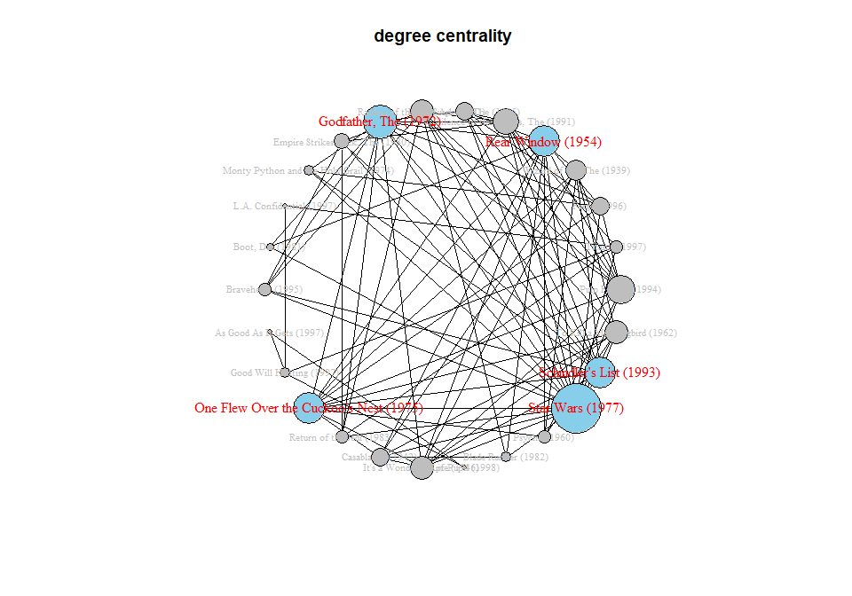
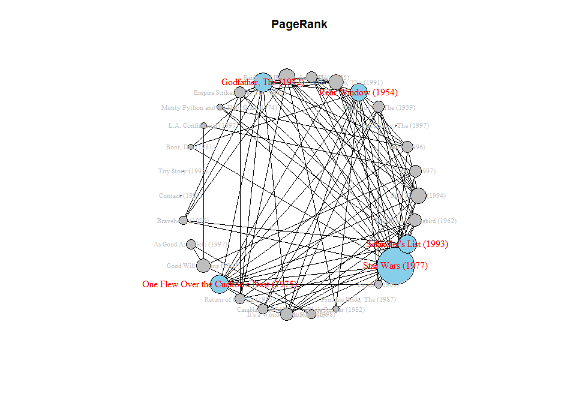

HW6-lil112
================
Liping Li (<lil112@pitt.edu>)
2017.03.28

Task 2: Create a movie-to-movie co-rating network
=================================================

2.1 Prepare data
----------------

Extract data where the ratings are generated after timestamp 03/20/1998 00:00:00 and equal to rating 5. Extract the top 30 most frequently rated movies as the nodes.

``` r
data.file = "http://files.grouplens.org/datasets/movielens/ml-100k/u.data"
dataset = read.csv(data.file, sep = "\t", header = F)
colnames(dataset) = c("userID","itemID", "rating", "timestamp")
dim(dataset)
```

    ## [1] 100000      4

03/20/1998 00:00:00 converts to unix time is 890352000. Rating equals 5.

``` r
d1 = subset(dataset, timestamp > 890352000)
d1 = subset(d1, rating == 5)

# Extract the top 30 most frequently rated movies' ID
movies = sort(table(d1$itemID), decreasing = T)
movies = rownames(movies[1:30]) 
movies[1:4]
```

    ## [1] "50"  "313" "272" "100"

Generate a network with edge weights &gt;= 10, i.e., two movies have a link if they are rated by at least 10 common users.

``` r
library(igraph)
```

    ## 
    ## Attaching package: 'igraph'

    ## The following objects are masked from 'package:stats':
    ## 
    ##     decompose, spectrum

    ## The following object is masked from 'package:base':
    ## 
    ##     union

``` r
d1 = subset(d1, itemID %in% movies)
g = graph.data.frame(d1, directed = T)
mat = as.matrix(get.adjacency(g))
m1 = t(mat) %*% mat # movie-movie matrix
m1[m1 < 10] = 0 # number of ratings < 10, then 0

movie.idx = which(colSums(m1) >= 10)
movie.mat = m1[movie.idx, movie.idx] 
diag(movie.mat) = 0 # self with self = 0, contained in movie.mat

movie.idx = which(colSums(movie.mat) >= 10)
# self with self = 0, not contained in movie.mat2
movie.mat2 = movie.mat[movie.idx, movie.idx]

dim(movie.mat)
```

    ## [1] 30 30

``` r
dim(movie.mat2)
```

    ## [1] 26 26

Load u.item to replace movieID with movies titles. List the names of the top 10 movies and their number of ratings.

``` r
title.idx = as.numeric(rownames(movie.mat))
titles.path = "http://files.grouplens.org/datasets/movielens/ml-100k/u.item"
movie.titles = read.csv(titles.path, sep="|", fill=T, header=F)
movie.names = movie.titles[title.idx,1:2]
row.names(movie.mat)=movie.names$V2 # replace rownames of movie.mat
colnames(movie.mat)=movie.names$V2

title.idx2 = as.numeric(rownames(movie.mat2))
movie.names2 = movie.titles[title.idx2,1:2]
row.names(movie.mat2)=movie.names2$V2 # replace rownames of movie.mat
colnames(movie.mat2)=movie.names2$V2

# get number of ratings
numRatings = data.frame(rowSums(movie.mat))
numRatings = cbind(data.frame(movie.names$V2),numRatings)
colnames(numRatings) = c("title","numRatings")
row.names(numRatings)= NULL
numRatings = numRatings[order(numRatings$numRatings, decreasing = T),]
numRatings[1:10,]
```

    ##                                     title numRatings
    ## 28                       Star Wars (1977)        287
    ## 10                  Godfather, The (1972)        149
    ## 29                Schindler's List (1993)        146
    ## 20 One Flew Over the Cuckoo's Nest (1975)        145
    ## 6                      Rear Window (1954)        134
    ## 9          Raiders of the Lost Ark (1981)        122
    ## 1                     Pulp Fiction (1994)        121
    ## 7        Silence of the Lambs, The (1991)        110
    ## 23           It's a Wonderful Life (1946)         99
    ## 30           To Kill a Mockingbird (1962)         98

2.2 Identify the community
--------------------------

Identify the community structure in the network by using the modularity-based community detection algorithm.

### movie.mat 30x30

``` r
g1 = graph.adjacency(movie.mat, weighted=T, mode = "undirected", diag = F)
## get modularity-based community
fc = fastgreedy.community(g1)
modularity(fc)
```

    ## [1] 0.2449576

Plot the network with the detected community structure and the dendrogram .

``` r
set.seed(1)
plot(fc, g1, main = "modularity community", layout = layout.fruchterman.reingold, 
     vertex.size = 8, vertex.label.cex = 0.8)
```


``` r
dendPlot(fc)
```


### movie.mat2 26x26

``` r
g2 = graph.adjacency(movie.mat2, weighted=T, mode = "undirected", diag = F)
## get modularity-based community
fc = fastgreedy.community(g2)
modularity(fc)
```

    ## [1] 0.2449576

Plot the network with the detected community structure and the dendrogram .

``` r
set.seed(1)
plot(fc, g2, main = "modularity community", layout = layout.fruchterman.reingold, 
     vertex.size = 8, vertex.label.cex = 0.8)
```


``` r
dendPlot(fc)
```

 \#\# 2.3 Identify the most central nodes \#\#\# Degree centrality

``` r
deg = degree(g1)
top = order(deg, decreasing = T)[1:5] 
## size node by degree
centralPlot <- function(g,deg,top,n=1.5)
{
V(g)$size = abs(deg)*n
V(g)$color = "gray"
V(g)$label.color = "gray"
V(g)$label.cex = 0.7
E(g)$color = "black"
V(g)[top]$label.color = "red"  ## highlight the top-5 nodes
V(g)[top]$label.cex = 1
V(g)[top]$color = "Skyblue"
set.seed(1)
plot(g, layout = layout.circle)
}
centralPlot(g1,deg,top,1.5)
title("degree centrality")
```

 \#\#\# When I used 30x30 matrix, the relationships between connected movied are not clear.

``` r
## compute node closeness centrality
deg = degree(g2)
top = order(deg, decreasing = T)[1:5]

centralPlot(g2,deg,top,1.5)
title("degree centrality")
```

 Whether exluding 4 independent nodes does not influence the structure.

### Closeness centrality

``` r
## compute node closeness centrality
clo = closeness(g1)
top = order(clo, decreasing = T)[1:5]

centralPlot(g1,clo,top,1e+04)
title("closeness")
```


### Betweenness centrality

``` r
## compute node closeness centrality
bet = betweenness(g1)
top = order(bet, decreasing = T)[1:5]

centralPlot(g1,bet,top,0.5)
title("betweenness")
```


### PageRank

``` r
## compute node closeness centrality
pg = page.rank(g1)$vector
top = order(pg, decreasing = T)[1:5]

centralPlot(g1,pg,top,300)
title("PageRank")
```



2.4 Observation based on these plots
------------------------------------

### 2.4.1 Independent nodes do not influence modularity community.

Whether excluding 4 independent nodes(has 10 more ratings, but no &gt;=10 weighted link with other node), the modularity community structure is not affected except adding 4 independent dots. So it is with dendrogram. \#\#\# 2.4.2 Four centrality algorithms are different from each other. Degree centrality highlights nodes with most edges.

Closeness highlights nodes has shortest average path to other nodes. In this case, most nodes have similar weight(reflect in dot size) in terms of closeness.

Betweenness shows nodes play a important role in brigding other nodes. Bridges to different part have highest weight.

PageRank plot in this case is alike Degree centrality plot because it lacks direction. \#\#\# 2.4.3 Top 3 most co-rated movies appear repeatly Star Wars (1977), Godfather, The (1972) and Schindler's List (1993) appear in all these centrality plots.

``` r
rm(list = ls())
```

Task 3: Recommender system based on the book rating data
========================================================

Prepare data
------------

load the BX-Book-Ratings.csv & BX-Books.csv data.

``` r
book.rating = read.csv("BX-Book-Ratings.csv",sep=";", head=T)
books = read.csv("BX-Books.csv",sep=";", head=T)
#colnames(dataset) = c("userID","itemID", "rating", "timestamp")
head(book.rating)
```

    ##   User.ID       ISBN Book.Rating
    ## 1  276725 034545104X           0
    ## 2  276726 0155061224           5
    ## 3  276727 0446520802           0
    ## 4  276729 052165615X           3
    ## 5  276729 0521795028           6
    ## 6  276733 2080674722           0

``` r
head(books)
```

    ##         ISBN
    ## 1 0195153448
    ## 2 0002005018
    ## 3 0060973129
    ## 4 0374157065
    ## 5 0393045218
    ## 6 0399135782
    ##                                                                                           Book.Title
    ## 1                                                                                Classical Mythology
    ## 2                                                                                       Clara Callan
    ## 3                                                                               Decision in Normandy
    ## 4 Flu: The Story of the Great Influenza Pandemic of 1918 and the Search for the Virus That Caused It
    ## 5                                                                             The Mummies of Urumchi
    ## 6                                                                             The Kitchen God's Wife
    ##            Book.Author Year.Of.Publication                  Publisher
    ## 1   Mark P. O. Morford                2002    Oxford University Press
    ## 2 Richard Bruce Wright                2001      HarperFlamingo Canada
    ## 3         Carlo D'Este                1991            HarperPerennial
    ## 4     Gina Bari Kolata                1999       Farrar Straus Giroux
    ## 5      E. J. W. Barber                1999 W. W. Norton &amp; Company
    ## 6              Amy Tan                1991           Putnam Pub Group
    ##                                                    Image.URL.S
    ## 1 http://images.amazon.com/images/P/0195153448.01.THUMBZZZ.jpg
    ## 2 http://images.amazon.com/images/P/0002005018.01.THUMBZZZ.jpg
    ## 3 http://images.amazon.com/images/P/0060973129.01.THUMBZZZ.jpg
    ## 4 http://images.amazon.com/images/P/0374157065.01.THUMBZZZ.jpg
    ## 5 http://images.amazon.com/images/P/0393045218.01.THUMBZZZ.jpg
    ## 6 http://images.amazon.com/images/P/0399135782.01.THUMBZZZ.jpg
    ##                                                    Image.URL.M
    ## 1 http://images.amazon.com/images/P/0195153448.01.MZZZZZZZ.jpg
    ## 2 http://images.amazon.com/images/P/0002005018.01.MZZZZZZZ.jpg
    ## 3 http://images.amazon.com/images/P/0060973129.01.MZZZZZZZ.jpg
    ## 4 http://images.amazon.com/images/P/0374157065.01.MZZZZZZZ.jpg
    ## 5 http://images.amazon.com/images/P/0393045218.01.MZZZZZZZ.jpg
    ## 6 http://images.amazon.com/images/P/0399135782.01.MZZZZZZZ.jpg
    ##                                                    Image.URL.L
    ## 1 http://images.amazon.com/images/P/0195153448.01.LZZZZZZZ.jpg
    ## 2 http://images.amazon.com/images/P/0002005018.01.LZZZZZZZ.jpg
    ## 3 http://images.amazon.com/images/P/0060973129.01.LZZZZZZZ.jpg
    ## 4 http://images.amazon.com/images/P/0374157065.01.LZZZZZZZ.jpg
    ## 5 http://images.amazon.com/images/P/0393045218.01.LZZZZZZZ.jpg
    ## 6 http://images.amazon.com/images/P/0399135782.01.LZZZZZZZ.jpg

``` r
books = books[,c(1,4)]
dim(book.rating)
```

    ## [1] 542882      3

``` r
dim(books)
```

    ## [1] 115253      2

Extract books published from 1998 to present.

``` r
## published after 1988
colnames(books)=c("ISBN","PublishYear")
books$PublishYear = as.character(books$PublishYear)
books$PublishYear = as.numeric(books$PublishYear)
books2 = books[books$PublishYear >= 1998,]
dim(books2)
```

    ## [1] 47876     2

``` r
rm(books)
```

Create a book rating matrix from these books, and in this matrix, only consider books that were rated by at least 10 users, and users that rated at least 10 books.

``` r
library(Matrix)
legalISBN = unique(books2$ISBN)
book.rating = subset(book.rating, ISBN %in% legalISBN)
# rating = data.frame(from = book.rating$User.ID, to = book.rating$ISBN, 
#                     weight = book.rating$Book.Rating)
g = graph.data.frame(book.rating)
mat = get.adjacency(g)
mat.w = get.adjacency(g, attr = "Book.Rating")
user.idx = which(rowSums(mat) >= 10)
book.idx = which(colSums(mat) >= 10)

rmat = mat.w[user.idx, book.idx]
dim(rmat)
```

    ## [1] 1694 1550

3.1 Run and test a recommender system built with different recommendation methods
---------------------------------------------------------------------------------

``` r
suppressMessages(library(recommenderlab))
m = as.matrix(rmat)
m = as(m, "realRatingMatrix")
dim(m)
```

    ## [1] 1694 1550

``` r
e = evaluationScheme(m, method = "cross", given=10,k = 4, goodRating = 6)
r1 = Recommender(getData(e, "train"), "RANDOM")
r2 = Recommender(getData(e, "train"), "POPULAR")
r3 = Recommender(getData(e, "train"), "UBCF")
r4 = Recommender(getData(e, "train"), "IBCF")
p1 = predict(r1, getData(e, "known"), type = "ratings")
p2 = predict(r2, getData(e, "known"), type = "ratings")
p3 = predict(r3, getData(e, "known"), type = "ratings")
p4 = predict(r4, getData(e, "known"), type = "ratings")
error = cbind(calcPredictionAccuracy(p1, getData(e, "unknown")), 
              calcPredictionAccuracy(p2, getData(e, "unknown")),
              calcPredictionAccuracy(p3, getData(e, "unknown")),
              calcPredictionAccuracy(p4, getData(e, "unknown")))
colnames(error) = c("RANDOM","POPULAR","UBCF", "IBCF")
error
```

    ##         RANDOM    POPULAR      UBCF     IBCF
    ## RMSE 0.9462815 0.52108196 0.5237604 2.921909
    ## MSE  0.8954487 0.27152641 0.2743250 8.537549
    ## MAE  0.4621376 0.08081542 0.0570821 1.034465

3.2 Observation
---------------

Item-based collaborative filtering(IBCF) got the worst performance, even worse than RANDOM method锛宻uggesting it changed a lot when doing cross-validation sampling.

POPULAR method and User-based collaborative filtering get better results. User-based similarity is more dynamic, therefore recomputing user neighbourhood can lead to poor predictions. But here, UBCF seems survive from cross-validation.
